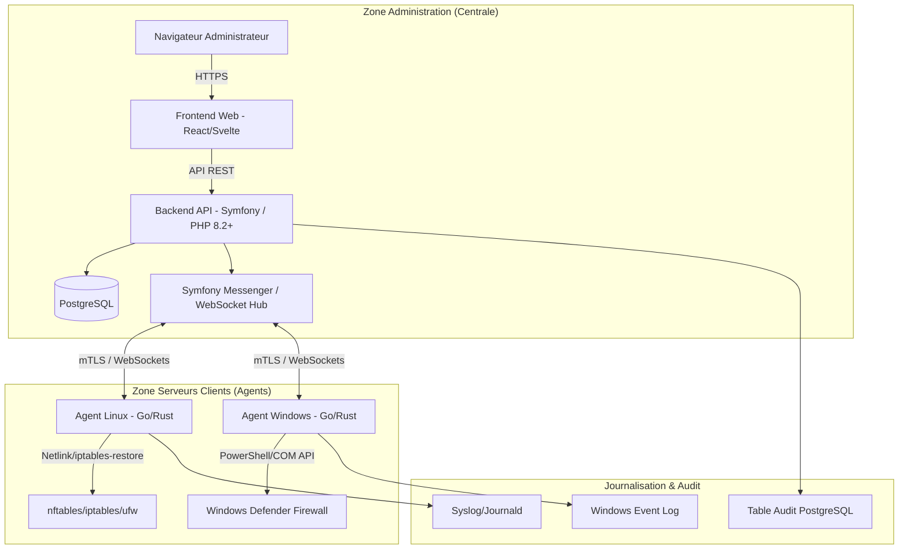

# Architecture Globale - Système de Gestion Centralisée de Pare-feu (Firewall Central)

## 1. Vue d'ensemble de l'architecture
Le système est conçu comme une architecture agent-serveur distribuée. Un serveur central (**Control Plane**) gère les politiques et l'état, tandis que des agents légers (**Data Plane**) s'exécutent sur chaque serveur cible pour appliquer les règles.

### Schéma Logique des Composants


## 2. Composants Principaux

### 2.1 Interface d'Administration (Frontend)
- **Tableau de bord :** Visualisation de l'état de santé du parc (agents en ligne/hors ligne).
- **Gestionnaire de règles :** Interface de création de règles génériques "Single Source of Truth".
- **Groupes :** Regroupement logique de serveurs par environnement (Prod, Dev), application ou zone réseau.

### 2.2 Backend API (Symfony)
- **Authentification :** Utilisation du composant Security de Symfony (Authenticators) pour le RBAC et le mTLS.
- **Orchestrateur :** Traduit les règles métier en commandes structurées pour les agents via Symfony Messenger.
- **Gestion d'état :** Maintient une base de données de l'état "voulu" vs état "réel" rapporté par les agents.

### 2.3 Message Broker / Canal de Commande
- Utilisation de **WebSockets sécurisés (WSS)** avec **mTLS**.
- L'agent initie la connexion vers le serveur central (sortant), ce qui permet de traverser les NAT/Pare-feu sans ouverture de port entrant sur le serveur client.

### 2.4 Agents (Linux & Windows)
- **Exécution :** Service système (systemd / Windows Service).
- **Moteur d'abstraction :** Traduit le JSON générique en commandes spécifiques à l'OS.
- **Sécurité locale :** Validation des règles pour éviter l'auto-blocage (Anti-Lockout) et rollback automatique.

## 3. Arborescence du Projet Proposée
```text
firewall-central/
├── agent/                  # Code source des agents (Go/Rust)
│   ├── common/             # Logique partagée (proto, crypto)
│   ├── linux/              # Implémentation spécifique Linux
│   └── windows/            # Implémentation spécifique Windows
├── backend/                # Serveur Central (Symfony)
│   ├── config/             # Configuration Symfony
│   ├── src/                # Entités, Controlleurs, Services, Security
│   └── public/             # Point d'entrée web
├── frontend/               # Interface Web (React/Vite)
├── docs/                   # Documentation technique et spécifications
│   ├── architecture/
│   └── api/
├── scripts/                # Scripts d'installation et de validation
└── deployments/            # Docker, Kubernetes, Systemd units
```

## 4. Roadmap & Découpage (MVP vs Futur)

### Phase 1 : MVP (Sécurité et Connectivité)
- Agent Linux (nftables) et Windows.
- Communication WebSocket + mTLS.
- Backend Symfony avec gestion de base des serveurs et règles.
- Mécanisme d'Anti-Lockout (Rollback automatique).

### Phase 2 : Améliorations Opérationnelles
- Gestion des groupes de serveurs et déploiement groupé.
- Audit Trail complet.
- Mode Dry-run avec prévisualisation.

### Phase 3 : Avancé & Entreprise
- Détection des dérives (règles manuelles).
- Mise à jour automatique des agents.
- Intégration LDAP/AD.
